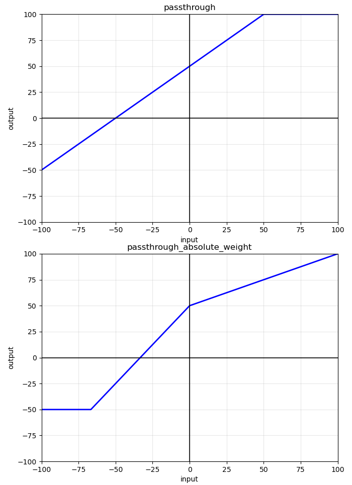
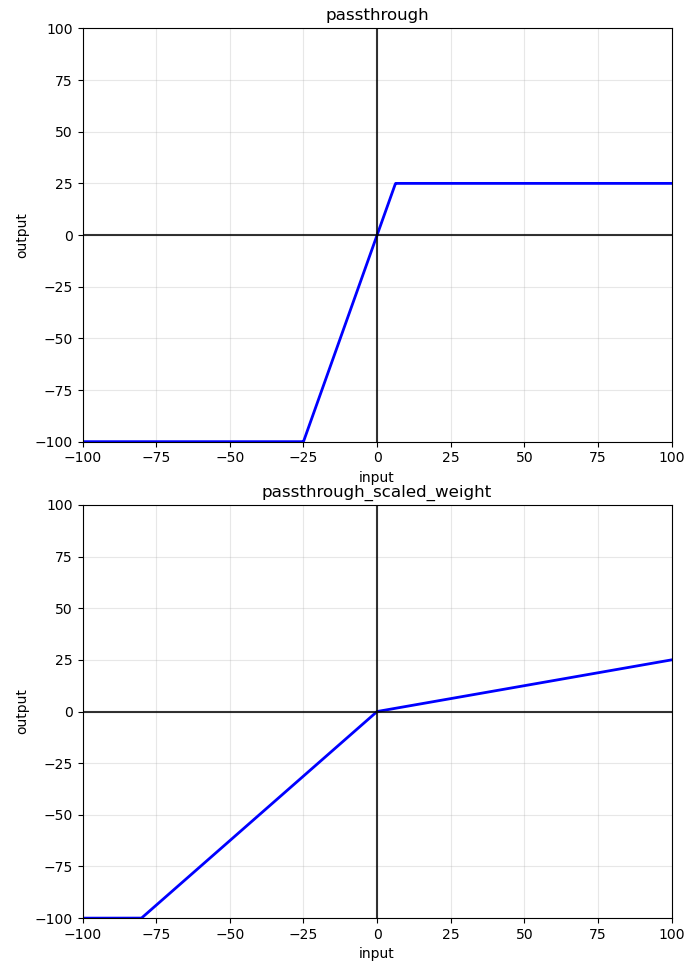
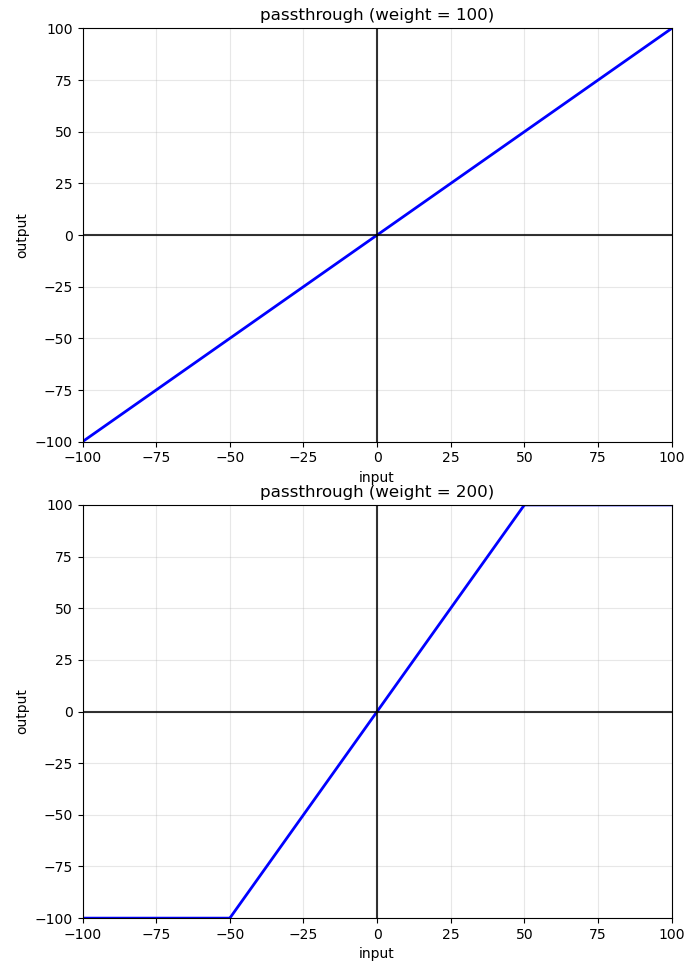
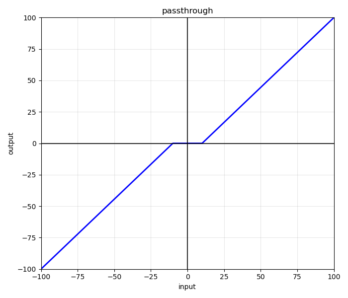
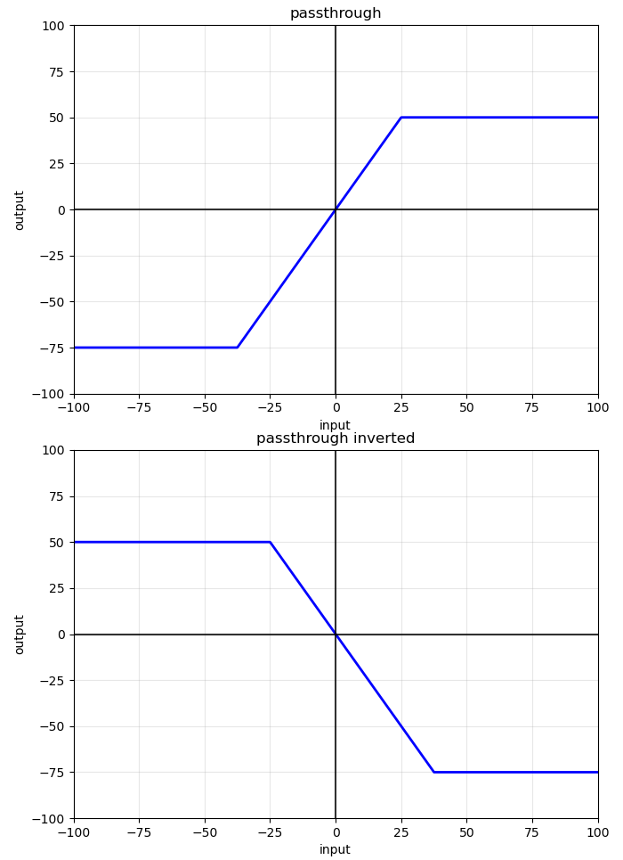
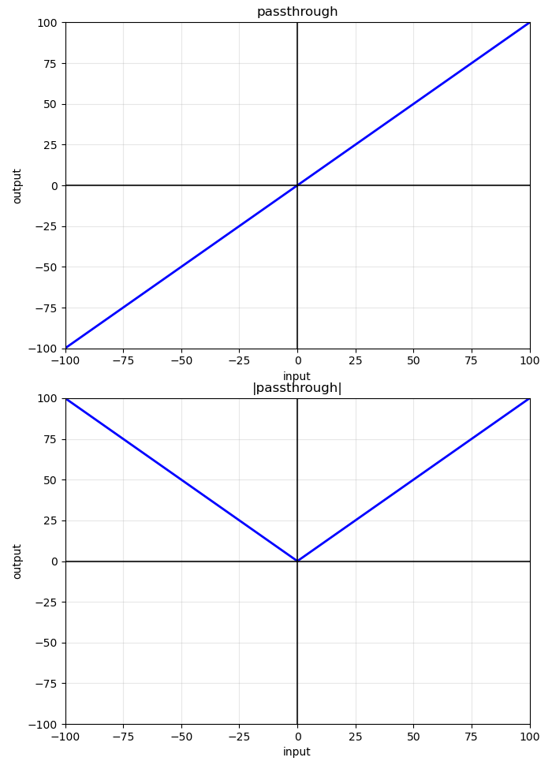

# selk_rc_transmitter

Linux gamepad controls transmitter. Requires [selk_rc_receiver](https://github.com/KelpieRobotics/selk_rc_receiver) to receive and output as an SBUS receiver.

## Config

### Mappings

#### Axis

##### `mode`
Currently mode can be one of the following:

* ###### `passthrough`

This mode should be used in most cases. Input is passthrough, with certain modifications to the signal. See the descriptions of other params to determine their function.

Example
```yaml
mappings:
  axis:
    "passthrough":
      channel: None
      mode: passthrough
      weight: 200
      min: -75
      max: 50
      center: 0
      deadband: 0
```


* ###### `passthrough_absolute_weight`

Similar to passthrough, however, the `weight` param has a different behaviour when `center` is not zero.

In `passthrough` mode, the `weight` will be offset by the `center` value. This is useful when you want to move the center point of the output but keep the same rate of change for a given change of input.

However, in `passthrough_absolute_weight` mode, the weight determines to what value output is extrapolated at 100 input when `max` is sufficiently large. That means when `center` is not zero, function still pass through the (100, `weight`) point (notice the slop of the function may be different if `max` != -`min`).

Example

```yaml
mappings:
  axis:
    "passthrough":
      channel: None
      mode: passthrough
      weight: 100
      min: -50
      max: 100
      center: 50
      deadband: 0

    "passthrough_absolute_weight":
      channel: None
      mode: "passthrough_absolute_weight"
      weight: 100
      min: -50
      max: 100
      center: 50
      deadband: 0

```



* ###### `passthrough_scaled_weight`

Similar to `passthrough` with a different behaviour around limits.

In `passthrough` mode, the `weight` param determines the slop of the function, with `min` and `max` parameters creating a hard cap on the value.

Using `passthrough_scaled_weight`, `weight` param is ignored, and the slope is determined by the `min` and `max` params. The function will pass through both (-100, `min`) and (100, `max`). It consists of 2 linear segments from (0, `center`) to these points.

Example
```yaml
mappings:
  axis:
    "passthrough":
      channel: None
      mode: passthrough
      weight: 400
      min: -125
      max: 25
      center: 0
      deadband: 0

    "passthrough_scaled_weight":
      channel: None
      mode: "passthrough_scaled_weight"
      weight: 400 # does nothing
      min: -125
      max: 25
      center: 0
      deadband: 0
```



##### `weight`

The slope of the linear function in terms of percentage (`weight: 100` corresponds to the equivalent of y=x, while `weight: 200` is y=2x).

Note: Depending on the `mode` and other params (such as `deadband`) the actual slope may be differ from the weight parameter. Consult this documentation and visualize your config, to better understand how it works.

Examples

```yaml
mappings:
  axis:
    "passthrough (weight = 100)":
      channel: None
      mode: passthrough
      weight: 100
      min: -100
      max: 100
      center: 0
      deadband: 0

    "passthrough (weight = 200)":
      channel: None
      mode: passthrough
      weight: 200
      min: -100
      max: 100
      center: 0
      deadband: 0
```



##### `min`

The output limit when input is negative.

##### `max`

The output limit when input is positive.

##### `center`

They y-axis offset. This is the output when input is equal to 0 (center of the stick)

##### `deadband`

Maximum deviation from 0 input, where the stick is "dead" (should be reading 0). This parameter can be used to correct for stick drift.

Example

```yaml
mappings:
  axis:
    "passthrough":
      channel: None
      mode: passthrough
      weight: 100
      min: -100
      max: 100
      center: 0
      deadband: 10
```



##### Tips and Tricks
* ###### Invert
You can invert any input but swapping around `min` and `max` params.

Note: Do not invert weight, as inverting weight as well will revert change the slope back the original value.

Example

```yaml
mappings:
  axis:
    "passthrough":
      channel: None
      mode: passthrough
      weight: 200
      min: -75
      max: 50
      center: 0
      deadband: 0

    "passthrough inverted":
      channel: None
      mode: passthrough
      weight: 200
      min: 50
      max: -75
      center: 0
      deadband: 0
```



* ###### Y-axis Symmetry and Abs

The sign of either `min` or `max` also decided the sign on the slope. We can create an abs function by making the `min` param positive.

Example

```yaml
mappings:
  axis:
    "passthrough":
      channel: None
      mode: passthrough
      weight: 100
      min: -100
      max: 100
      center: 0
      deadband: 0

    "|passthrough|":
      channel: None
      mode: passthrough
      weight: 100
      min: 100
      max: 100
      center: 0
      deadband: 0
```


